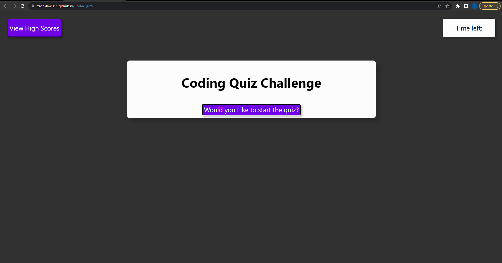
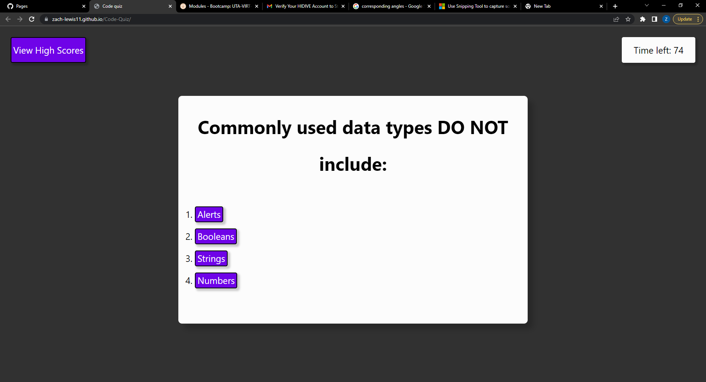

# Code-Quiz
Web APIs Challenge 

Code-Quiz v0.8

## Goal

The main goal of this challenge was to use JavaScript to Create a small quiz about coding. In making this project I used Javascript to iderate through the questins, populate the options buttons with the corresponding  and to check if slected awnser are true or false. 

## Usage 

To take the quiz, load page and click the start button. Then the first question will populate the screen, simply click on the awnser you would like to submit and the next card will automatically load. *NOTE* A wrong Awnser will remove 15 seconds from the timmer. When there is not time left or you awnser the question a prompt will ask you to input your intials and store your score *NOTE* score = time left on timmer.

 

## MIT License 
